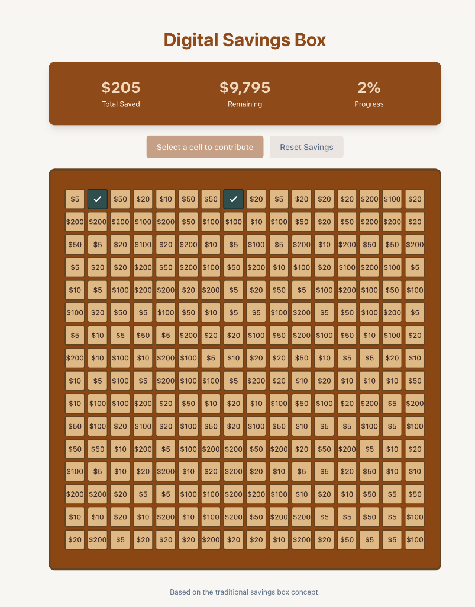

# Money Box

A modern, functional digital savings box application that tracks your savings journey using a grid-based contribution system.



## Overview

The Digital Savings Box allows users to select grid cells and make "contributions" toward a total goal. Each cell has a predefined dollar value. When a cell is contributed to via Stripe Checkout, it is marked as "filled", and the total saved amount is tracked against a $10,000 goal.

## Features Realized
* **Interactive Grid System**: 200 grid cells with varied amounts ranging from $5 to $200.
* **Real-time Status Tracking**: Cells update instantly when transitioning between `empty`, `pending`, and `filled`.
* **Stripe Checkout Integration**: Seamless payment processing and checkout flow.
* **Supabase Backend**: Uses Edge Functions and Webhooks to securely manage database state and process Stripe events.
* **Responsive Design**: Beautiful, solid "wooden box" theme that adapts to desktop and mobile screens.

## Quick Start

### Installation

1. Clone the repository:
   ```bash
   git clone <YOUR_GIT_URL>
   cd money-box
   ```

2. Install dependencies:
   ```bash
   npm i
   ```

3. Setup environment variables by copying `.env.example` to `.env` and adding your Supabase/Stripe keys.

4. Start the development server:
   ```bash
   npm run dev
   ```

## Technology Stack

* **Frontend**: React, TypeScript, Tailwind CSS, Vite, shadcn-ui
* **Backend**: Supabase (Database + Auth), Supabase Edge Functions (Deno)
* **Payments**: Stripe Checkout & Webhooks
